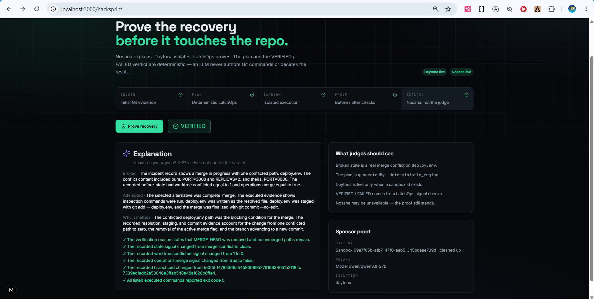

# LatchOps

**Prove a Git recovery in an isolated sandbox before it touches the real repo.**

LatchOps classifies dangerous Git states and produces canonical recovery plans with the deterministic engines. No LLM writes commands. No LLM decides **VERIFIED** or **FAILED**.

Built for [Daytona HackSprint Seoul](https://daytona.io): reproduce a broken checkout-service merge in a disposable Daytona sandbox, execute only allowlisted plan steps, verify the result, then optionally let Nosana explain the evidence.

<p align="center">
  
</p>

---

## The pitch

A fictional checkout team is merging `release/checkout-api` into `main`. Both branches independently changed `deploy.env` (environment, port, replicas, health check, rollout). Git stopped with `MERGE_HEAD` and one unmerged path.

LatchOps does not “fix Git with AI.” It:

1. **Classifies** the incident from a real snapshot (`merge_conflict`)
2. **Plans** a canonical `complete_merge` with `@latchops/recovery-engine`
3. **Executes** that plan inside Daytona — never in this monorepo
4. **Verifies** with `verifyRecovery` (`MERGE_HEAD` gone, zero conflicted paths)
5. **Explains** the evidence with Nosana only if the key is live

Resolution of the advisory/manual edit is labeled **controlled demo orchestration**, not an AI-generated fix. The production contract in the demo README (`PORT=8443`, `/healthz`, 3 replicas, rolling) is what gets written.

---

## What is deterministic vs sponsored

| Layer | Authority |
|---|---|
| Snapshot → signals → plan | `@latchops/state-engine` + `@latchops/recovery-engine` |
| Verdict | `verifyRecovery` only |
| Isolation | Daytona labeled **live** only after `create()` returns a sandbox id; cleaned up in `finally` |
| Explanation | Nosana `chat/completions` after discovering a chat model from `/models`. Optional. Never authors commands or the verdict. |

If Daytona or Nosana is down, say so. Do not claim they ran.

---

## 3-minute demo

```bash
pnpm install
pnpm --filter @latchops/schema build
pnpm --filter @latchops/state-engine build
pnpm --filter @latchops/recovery-engine build
cp apps/web/.env.example apps/web/.env.local
# set DAYTONA_API_KEY (required to prove Daytona)
# set NOSANA_API_KEY (optional explanation)
pnpm dev:web
```

Open **http://localhost:3000/hacksprint** (`/proof` is an alias).

Flow: **BROKEN → PLAN → SANDBOX → PROOF → EXPLAIN**. Click **Prove recovery**.

Sponsor keys stay server-side. See [`HACKSPRINT_DEMO.md`](./HACKSPRINT_DEMO.md) for the exact path, Vercel Preview notes, and how we refuse to fake a live capture.

---

## Product (beyond the sprint)

| Piece | Role |
|---|---|
| **CLI** (`apps/cli`) | Read-only `snapshot` / `diagnose` / `plan` / `verify` / `send` |
| **State engine** | `SnapshotV1` → `RepoSignalsV1` |
| **Recovery engine** | Canonical `RecoveryPlanV1` + `verifyRecovery` |
| **Schema** | Shared Zod contracts |
| **Web** | Incident room + `/hacksprint` recovery proof |

```text
SnapshotV1 → RepoSignalsV1 → RecoveryPlanV1 → allowlisted exec → verifyRecovery → VERIFIED | FAILED
                                                                      └── Nosana explains (optional)
```

---

## Local CLI

```bash
pnpm build:cli
pnpm cli diagnose
pnpm cli plan
pnpm cli send --open   # with pnpm dev:web
```

---

## Honesty

- Analysis is rule-based. There is no LLM in the recovery path.
- `/hacksprint` uses a **reproducible demo incident**, not a customer production repo.
- Daytona is live only with a real sandbox id. Nosana is live only after a successful inference call.
- CLI snapshot/send is read-only on the repository you point it at.

MIT
